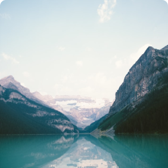

# Project 3: Around The U.S.

### Overview

- Intro
- Figma
- Images
- Technologies

**Intro**

This project implements responsive design for different screen resolutions.  
This project is made so all the elements are displayed correctly on popular screen sizes. We have a view of 1280px - standard screen.
we have view of 800px - tablets and we have view for 320px - mobile phone.
This project was very diifuclt for me personally because its huge step forward at the level and requirments.

**Technologies**

- Semantic HTML5
- Flexbox
- Grid Layout
- Positioning
- Flat BEM file structure
- Media Queries
- Responsive Design

**Figma**

- [Link to the project on Figma](https://www.figma.com/file/ii4xxsJ0ghevUOcssTlHZv/Sprint-3%3A-Around-the-US?node-id=0%3A1)

**Link to web page**

- [link to the project on github pages](https://michael71161.github.io/se_project_aroundtheus/)

**Link for live review video**

-[link for review video](https://drive.google.com/file/d/1WS8m2BrwnDxFmZkUE9XObExTfe3rS2GY/view?usp=drive_link)

**Images**

Images used:

- Avatar image for profile, Jacques Cousteau the explorer

- Yosemite Valley

- Lake Louise

- Bald Mountains

- Latemar

- Vanoise National Park

- Lago Di Braie

Good luck and have fun!
